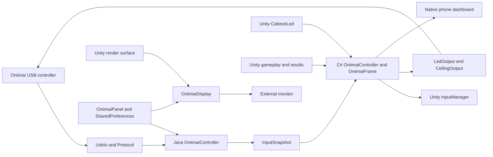
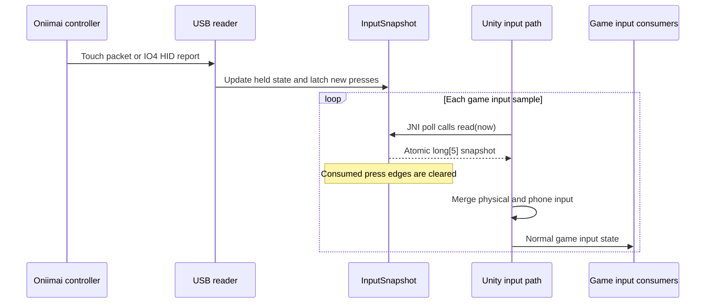
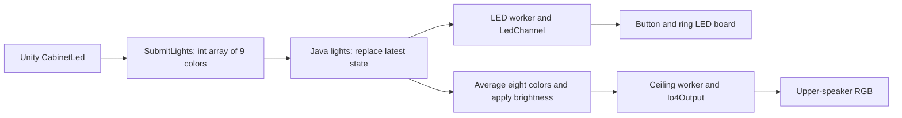
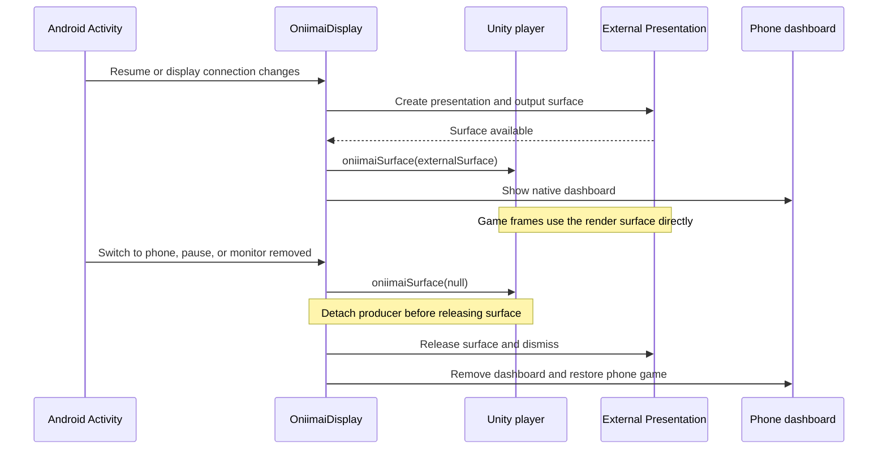

# Developing MajdataPlay Oniimai

For a code review, start with [Architecture](#architecture), then the
[frame-rate rationale](#why-rendering-is-locked-to-60-or-120fps) and
[review checklist](#what-an-upstream-reviewer-should-inspect). To build a test
APK, start with [Clone and build](#clone-and-build).

## Review baseline

| Item | Value |
| --- | --- |
| Upstream | [TeamMajdata/MajdataPlay](https://github.com/TeamMajdata/MajdataPlay) |
| Upstream base | Nightly `2.0.3-20260925-5e9c2aa`, commit `5e9c2aa9d0aec133c5dcfca9e0dbcc228d39416b` |
| Integration snapshot | Oniimai `0.2.18` |
| Android version | `2.0.3-oniimai.22`, version code `22` |
| Application ID | `net.majdata.majdataplay.oniimai` |
| Runtime | Android API 26+, ARM64, Unity IL2CPP, OpenGL ES 3 |
| Base branch | `upstream-nightly-20260925` (pinned upstream Nightly commit) |
| Integration branch | `main` |

This public fork preserves the original commit ancestry. `main` contains the
Oniimai integration; `dev` is the upstream branch copied when the fork was created.
The APK is published in the [Oniimai 0.2.18 release](https://github.com/kyarameru0/MajdataPlay/releases/tag/oniimai-v0.2.18).
No upstream PR has been opened. The integration is kept separate for review first.

The 0.2.18 integration uses the latest published upstream build available on
September 27, 2026, while preserving the Oniimai integration. The moving `dev`
branch already contains newer, unreleased commits; those are not the published
build selected for this update. The pinned `upstream-nightly-20260925` branch is
the comparison base. The Nightly adds renderer changes, render-scale settings,
chart radar, and updated HidSharp/UniTask dependencies, including the MajRadar
submodule. Build outputs, signing keys, and device logs are not committed.

## Clone and build

Clone the public fork, including its dependencies:

```powershell
git clone --recurse-submodules https://github.com/kyarameru0/MajdataPlay.git
cd MajdataPlay
git remote add upstream https://github.com/TeamMajdata/MajdataPlay.git
```

For an existing clone, run `git submodule update --init --recursive`. Submodules
remain pinned Git dependencies rather than copies of their expanded working trees.
Git LFS is needed for historical LFS assets if you check out older revisions.

Install the Unity version in `ProjectSettings/ProjectVersion.txt` (**6000.3.17f1**)
with Android Build Support, OpenJDK, Android SDK, and NDK. Use this Editor's
supported tools: JDK 17, NDK r27c (`27.2.12479018`), SDK Build Tools 36, and SDK
Platform 35/36. Check **Preferences → External Tools → Android** if the Editor
reports a missing JDK or incompatible NDK. Activate your own Unity license. This
repository contains no Unity credentials or signing keys.

Open the project in Unity, allow package imports to finish, and select
**MajdataPlay → Build Oniimai Android**. Alternatively, close the editor for this
project and run:

```powershell
./Tools/Build-Oniimai.ps1 `
  -UnityEditor 'C:/Program Files/Unity/Hub/Editor/6000.3.17f1/Editor/Unity.exe' `
  -Output './Build/Oniimai-MajdataPlay.apk'
```

The script writes `Build/Oniimai-build.log`. `OniimaiBuild.Android` runs the C#
regression checks and configures an ARM64 IL2CPP APK with OpenGL ES 3, portrait
orientation, and Unity Android frame pacing disabled. It uses the default debug
signing configuration for local testing. Configure your own signing setup before
distributing a production build; never commit a private keystore.

The whole game must be built with Unity. The optional .NET command below builds
only the isolated, Unity-independent regression harness.

## Architecture



The Java and C# bridges share a class name but have different responsibilities.
The C# side runs inside Unity; the Java side owns Android lifecycle and hardware.

| Area | Main source | Responsibility |
| --- | --- | --- |
| Activity lifecycle | `Assets/Plugins/Android/src/java/net/majdata/majdataplay/MajdataPlayActivity.java` | Creates and resumes the controller/display bridge |
| Android bridge | `Assets/Plugins/Android/src/java/net/majdata/majdataplay/oniimai/OniimaiController.java` | Device state, settings, input snapshots, light output, and native UI |
| USB | `oniimai/UsbIo.java`, `Protocol.java`, `PortSelection.java` | Transport, frame parsing, and saved/named port selection |
| Input merge | `Assets/Scripts/IO/OniimaiController.cs`, `OniimaiFrame.cs` | `MergeInput` combines physical input with the game's input path |
| LED | `oniimai/LedOutput.java`, `LedChannel.java`, `CeilingOutput.java`, `Io4Output.java` | Latest-frame delivery, acknowledgments, reconnect, and speaker RGB |
| Display | `oniimai/OniimaiDisplay.java`, `DisplayGeometry.java`, `OutputMode.java` | Presentation, rotated output surface, refresh-mode request, and phone return |
| Dashboard | `oniimai/DashboardView.java`, `DashboardLayout.java`, `DashboardWidget.java` | Widget layout, editing, state persistence, and real game statistics |
| Results | `Assets/Scripts/IO/OniimaiStatsRetention.cs` | Holds final statistics through results and clears them on exit |
| Settings | `oniimai/OniimaiPanel.java`, `InitialSetup.java`, `SetupDefaults.java` | In-game settings and first-run configuration |
| UI foundation | `oniimai/GameUi.java`, `GameAssets.java`, `UiTextCatalog.java` | Shared native View styles, original game assets, and localization |

`oniimai/` in the table is relative to
`Assets/Plugins/Android/src/java/net/majdata/majdataplay/`.

### 1. A physical press becomes game input

USB reader callbacks update `InputSnapshot`, which records both the current
state and newly pressed edges. The Unity input path calls the Java bridge's
`poll()` through JNI. `OniimaiFrame.Merge` combines the returned physical input
with the existing phone input instead of dispatching Android screen taps.



The JNI snapshot is an internal Java/C# contract, not the controller's USB packet:

| Index | Meaning |
| --- | --- |
| `frame[0]` | Eight button bits plus auxiliary P1; held state includes latched short presses |
| `frame[1]` | 34 raw touch-sensor bits, including both center halves |
| `frame[2]` | Newly pressed button bits since the previous game read |
| `frame[3]` | Newly pressed touch bits since the previous game read |
| `frame[4]` | Status/option flags: `1` touch connected, `2` buttons connected, `4` external output active, `8` P1 maps to A4, `16` selects 120fps |

Core merge logic from [OniimaiFrame.cs](Assets/Scripts/IO/OniimaiFrame.cs):

```csharp
buttons[i] |= (frame[0] & (1L << i)) != 0;
if ((frame[2] & (1L << i)) != 0)
    buttonClicks[i] = Math.Max(1, buttonClicks[i]);
```

The edge latch preserves a quick tap that begins and ends between game samples.
`Math.Max` avoids counting the same merged press twice. The existing game path
combines C1/C2 into its single center zone; changing center halves while holding
does not create another click. The sensor dashboard calls `diagnostic()` instead
of `read()`, so viewing the sensors cannot steal gameplay edges.

Input is gated while disabled, out of focus, or in the controller panel. After
such a transition the user must release the controls before presses are accepted
again. Touch/HID reports older than 500ms expire, preventing a disconnected
controller from leaving a held input active. Start review with
[InputSnapshot.java](Assets/Plugins/Android/src/java/net/majdata/majdataplay/oniimai/InputSnapshot.java)
and [InputManager.DummyInput.cs](Assets/Scripts/IO/InputManager/RawDeviceHandle/InputManager.DummyInput.cs).

### 2. Game lighting reaches the hardware

Unity's existing `CabinetLed` output is forwarded through `SubmitLights` as nine
packed RGB integers: eight button colors and the cabinet brightness represented
as a grayscale color. Java's `lights()` submits that state to `LedOutput` and
`CeilingOutput`.



The dedicated workers run on approximately 33ms intervals. They keep the latest
state instead of accumulating an unbounded queue of stale animation frames.
The serial LED channel validates the board response and acknowledgments. On an
error it closes that LED channel and retries after 1, 2, 4, then at most 8 seconds;
it does not deliberately close touch input to recover lighting. Reconnection
resends current light state. Backgrounding blanks the lights, and new LED opens
wait until foreground. Explicit stop/destroy invalidates pending work using a
generation counter.

Start review with [LedOutput.java](Assets/Plugins/Android/src/java/net/majdata/majdataplay/oniimai/LedOutput.java),
[LedChannel.java](Assets/Plugins/Android/src/java/net/majdata/majdataplay/oniimai/LedChannel.java),
and [CeilingOutput.java](Assets/Plugins/Android/src/java/net/majdata/majdataplay/oniimai/CeilingOutput.java).

### 3. The external monitor and phone have different jobs

The game renders its portrait buffer to an Android `Presentation` surface on the
external display. A native Android dashboard occupies the phone screen. This
requires a display exposed by Android; it is not a screen-capture mirroring app.
The preferred route rotates/scales an app-owned SurfaceControl layer, while a
TextureView path provides compatibility where the preferred route is unavailable.



The surface teardown ordering is deliberate: destroying the consumer before
detaching Unity can disrupt rendering. Ordinary rotation/size changes update the
transform without intentionally recreating the Unity output surface. A draggable
shortcut lets the user return to external output after switching to the phone.
Review [OniimaiDisplay.java](Assets/Plugins/Android/src/java/net/majdata/majdataplay/oniimai/OniimaiDisplay.java)
alongside [MajdataPlayActivity.java](Assets/Plugins/Android/src/java/net/majdata/majdataplay/MajdataPlayActivity.java).

### 4. Dashboard statistics survive the result screen

`GameUpdater` calls `UpdateStats`, throttled to 100ms; the native dashboard refreshes
about every 150ms. Statistics use compact JSON, and cover/graph PNGs are sent only
when artwork changes. Live game frames are not copied into dashboard widgets.

`CaptureResult` saves final game-calculated judgments and score before gameplay
objects and textures are destroyed. `OniimaiStatsRetention` holds that exact
snapshot in Result/TotalResult and clears it on leaving results or entering a new
game session, including retry/practice. Course results display the last song's
record rather than inventing an aggregate. The retention state machine is
independent of whether an external monitor is currently connected.

## Rules to preserve when changing the code

- Keep Android-only Unity hooks behind the existing platform guards. Desktop
  input and lighting paths must keep their original behavior.
- Preserve press/release edges in input snapshots. Diagnostic widgets must not
  consume the gameplay input queue. Closing settings requires release before
  gameplay input becomes active again.
- Select the named Touch interface for touch input, not Command or NFC. Defaults
  must not overwrite a user's saved choices. P1 defaults to the game's P1 action.
- Keep LED I/O off the UI thread. Recover the LED channel independently of touch
  input, send only the newest state, and cancel retries on deliberate disconnect.
- Detach Unity before releasing an output surface. Rotation/size changes should
  avoid unnecessarily rebuilding the surface. Android 10+ uses an app-owned
  SurfaceControl path where available; the compatibility path uses TextureView.
- Keep the requested game frame rate separate from the actual monitor refresh
  rate. The default is 60fps. A 120fps choice requests a supported monitor mode;
  a failed 120Hz request falls back to 60Hz without erasing the user's preference.
- Capture final statistics before gameplay objects are destroyed. Retain them in
  Result/TotalResult and clear them when leaving results or starting a new run.
- Keep UI artwork static and small. Transfer updated artwork only when it changes;
  avoid rendering or decoding a full dashboard on every game frame.

The upper-speaker RGB color is derived from the average of the eight game button
colors because this base has no separate ceiling RGB game signal. This integration
does **not** implement Aime/NFC login; the base project uses its existing login
flow, and the NFC interface is excluded from automatic port assignment.

## Why rendering is locked to 60 or 120fps

In the tested Oniimai phone/adapter/monitor setup, running without a fixed frame
target produced frame drops and uneven motion on the external display, while
the phone display could still look smooth. The fixed-rate option exists to
address this observed external-output problem. **60fps is the default**;
**120fps is available for a compatible 120Hz display setup**.

`OniimaiController.MergeInput` receives the saved frame-rate choice with the
input snapshot and updates `Application.targetFrameRate` when that choice
changes. Android's `DisplayOptions.FPSLimit` reads the same value, so upstream
screen/display settings do not restore an unrelated profile FPS limit.
`OniimaiDisplay` separately requests a supported display mode through
`OutputMode`; the render target (fps) and actual display refresh (Hz) are not
interchangeable. A failed 120Hz mode request falls back to 60Hz while retaining
the selected preference for a future compatible display.

A target does not guarantee every frame meets its deadline, and a 60Hz output
cannot show 120 distinct frames per second. Keep the actual refresh-rate status
visible. Unity Android optimized frame pacing remains disabled in this variant;
the 60/120fps lock is a separate setting and does not enable that Unity option.

## Regression tests

Pass the path to a JDK 17+ installation (Unity's bundled OpenJDK is suitable):

```powershell
./Tools/OniimaiTests/run.ps1 -JavaHome 'C:/path/to/OpenJDK'
./Tools/OniimaiTests/run-hid.ps1 -JavaHome 'C:/path/to/OpenJDK'
```

The first command tests protocol parsing, LED acknowledgments/recovery, input
snapshots, defaults, port selection, geometry, output modes, and widget layouts.
The second compiles the actual HID transport against test fixtures; it does not
require a physical USB controller.

With the .NET 8 SDK installed, `run.ps1` also runs the frame-merge and result
retention tests. They can be invoked separately:

```powershell
dotnet run --project Tools/OniimaiTests/FrameMerge/FrameMerge.csproj --configuration Release
```

Without a .NET SDK, the same C# checks run at the beginning of the Unity build.

### Validation and limits

**0.2.18 / September 27, 2026:** the merged Nightly source passed the following:

- 9,027 Java regression assertions and 33 HID transport assertions.
- 186 C# frame-merge checks and 225 result-retention checks, run inside Unity.
- Upstream `RawSpriteDrawModeValidation`, covering mesh geometry and resource
  behavior. This does not compare rendered images against SpriteRenderer.
- A complete Unity 6000.3.17f1 ARM64 IL2CPP / OpenGL ES 3 Android APK build.
- APK v2 signature and ZIP CRC verification; package
  `net.majdata.majdataplay.oniimai`, version code `22`.
- All 42 exported Java source files matched the source used for the build.

Released APK: `MajdataPlay-Oniimai-0.2.18.apk`. It is byte-for-byte identical to
the `MajdataPlay-Oniimai-0.2.18-test.apk` tested by the maintainer. APKs are attached
to the release rather than committed to the source tree.

SHA-256: `33d08cf93c0fabdd46693710b1439cf90e143dd7af2d26de4867e02f71150ebd`

On September 27, 2026, the maintainer reported that this exact test APK worked
normally on their device setup. The artifact was built from commit
`064cdf5320f6627f5d01d497c96d2f89a2241c90`; the release source differs only in
README/developer-guide publication text. Its v2 signature, ZIP CRC, and matching
signing certificate with the previous test build were verified. The Unity build
reran all 186 input and 225 retention checks.

This confirmation is not a completed per-device compatibility matrix. It does
not establish working 120Hz output or every hotplug/lifecycle case listed below.

#### Historical 0.2.17 evidence

During the private repository import, the published checkout passed all 9,027
Java regression assertions and 33 HID transport assertions. All 161 integration
source/asset/tool files were compared with the 0.2.17 source archive, and all four
submodule revisions matched. The C# harness was not rerun during this import
because no .NET SDK was installed; no new Unity APK was built for this source-only
upload. The following build and device results are from the prior 0.2.17 record.

The 0.2.17 development record reports a successful ARM64 IL2CPP build, APK
signature/ZIP checks, 9,027 Java assertions, 186 C# frame checks, and 225 C# result
retention checks. Xiaomi device testing covered saved 60/120fps selection, fallback
to the actual 60Hz external mode, controller input, and lighting.

The available monitor advertised 1080p120 but did not apply the requested mode;
it returned to 4K60. This is not evidence of working 120Hz output or a guarantee
of stutter-free play. A new Unity build and hardware pass are required after
substantive changes, especially surface lifecycle or USB changes.

Before proposing upstream inclusion, also test a fresh installation, an upgrade
with saved settings, USB detach/reattach, monitor detach/reattach, both rotations,
background/resume, result-screen retention, and desktop behavior.

## What an upstream reviewer should inspect

| Review area | Relevant change or evidence |
| --- | --- |
| Platform boundary | Android Activity/JNI hooks and `UNITY_ANDROID && !UNITY_EDITOR` guards; verify desktop and iOS behavior separately |
| Input correctness | Edge latching, center merge, focus/settings gate, P1 mapping; Java snapshot tests and C# frame checks |
| USB recovery | Saved device identity, permission flow, detach handling, LED-only retries, and IO4 output serialization |
| Output lifecycle | Unity surface detachment before release, monitor hotplug, both rotations, return-to-phone behavior |
| Frame target | Default 60fps, saved 120fps choice, actual-Hz reporting and unsupported-mode fallback |
| Statistics | Final score capture before teardown, retention through results, reset on exit/retry, artwork lifetime |
| Rendering update | Upstream Nightly renderer/quality changes are inherited; compare against the pinned Nightly base to isolate Oniimai changes |
| Packaging | Separate application ID, version code 22, debug signing for this test build, no keys or local logs in Git |

For a future PR description, summarize the user-facing behavior first: an Android
Oniimai controller can drive the game's normal inputs and lighting while an
external display shows the game and the phone shows statistics. Link the diagrams
above, state the exact upstream base, and list automated/build checks separately
from physical-device checks. Ask upstream maintainers which defaults and package
identifier they want before proposing their production release configuration.

## Preparing an upstream PR later

Review this repository's `upstream-nightly-20260925...main` comparison first.
Keep the dated base branch unchanged so the integration remains easy to compare.

The public fork is ready for review; opening a PR is a separate step. When that
work begins, prepare a feature branch against the current upstream contribution
branch (`dev` at publication time):

```powershell
git fetch origin main upstream-nightly-20260925
git fetch upstream dev
git diff --binary --output=../oniimai-review.patch origin/upstream-nightly-20260925 origin/main
git switch -c oniimai-upstream upstream/dev
git apply --3way --index ../oniimai-review.patch
```

The patch contains only the integration delta from the pinned Nightly base.
Resolve conflicts against the current upstream version and run the tests/build again.
Do not assume the pinned Nightly integration will apply unchanged to a later
`dev`. Adapt fork-specific download links, versioning, and README text for the
upstream review before submitting. Never force-push this fork over upstream.

## Licensing and authorship

Keep the upstream GPL-3.0 license and all existing attribution, submodule license
files, and asset notices. Android companion art and fonts originate in this same
MajdataPlay tree; see the [asset provenance note](Assets/StreamingAssets/OniimaiUI/README.md).
The Oniimai additions were generated and revised with OpenAI Codex under human
direction. AI authorship does not replace code review, testing, or the upstream
license obligations.
