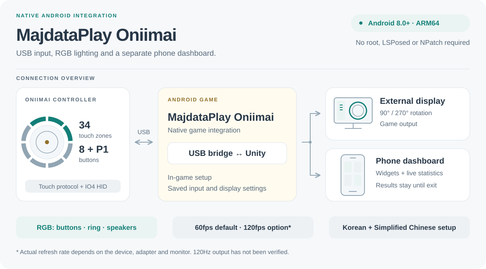
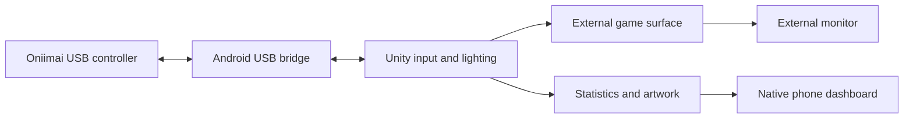

# MajdataPlay Oniimai

<picture>
  <source media="(prefers-color-scheme: dark)" srcset="Doc/Oniimai/overview-dark.svg" />
  <source media="(prefers-color-scheme: light)" srcset="Doc/Oniimai/overview-light.svg" />
  
</picture>

## Overview

This repository contains **MajdataPlay Oniimai 0.2.18**, based on the latest
published upstream Nightly checked on September 27, 2026:
[2.0.3-20260925-5e9c2aa](https://github.com/TeamMajdata/MajdataPlay/tree/5e9c2aa9d0aec133c5dcfca9e0dbcc228d39416b).
The upstream base is a Nightly snapshot; upstream's latest stable release remains
2.0.3 as of that date. This is an **unofficial public fork** of TeamMajdata/MajdataPlay
with the original Git history preserved. The integration runs inside the Android
game; it does not require LSPosed, NPatch, or root.

**[Download the Oniimai Android APK](https://github.com/kyarameru0/MajdataPlay-Oniimai/releases/tag/oniimai-v0.2.18)**
— Android 8.0+ / ARM64. The maintainer confirmed normal operation of this exact
APK on their test setup. Install it as a separate Oniimai app; it can also update
an existing Oniimai installation signed with the same key.

- USB touch input, IO4 HID buttons and P1, saved device selection, and sensitivity settings.
- Game-driven button/ring LEDs and upper-speaker RGB output.
- Rotated external game output with a separate, customizable phone dashboard.
- First-run setup in Korean or Simplified Chinese, saved widget layouts, and result retention.
- A 60fps default with a 120fps option and supported external display mode requests.
  Actual refresh rate depends on the phone, adapter, and monitor; 120Hz output has
  not been verified on the available hardware.

### Why the 60/120fps lock exists

Without a fixed frame-rate target, frame drops and uneven motion were observed
on the external display in the tested Oniimai setup, even when the phone's own
display appeared smooth. The integration therefore defaults to a **60fps lock**
and offers a **120fps lock** for a compatible 120Hz display setup.

The option sets the game's render target and requests the corresponding external
60/120Hz mode. It cannot force an unsupported refresh rate: the UI reports the
actual monitor rate separately, and an unsuccessful 120Hz request falls back to
60Hz. This is a workaround for the observed setup, not a guarantee that every
phone, USB-C adapter, or monitor will sustain the selected rate.

### How it works

An Android bridge reads the controller's USB interfaces and passes input snapshots
to Unity through JNI. The game uses its normal input/judgment path and sends its
lighting state back to dedicated USB workers. External output uses a separate
Android Presentation, leaving the phone available for native statistics widgets.



The [developer guide](ONIIMAI-DEVELOPMENT.md#architecture) walks through each
flow, the input snapshot contract, surface lifecycle, result retention, and the
source files and tests to inspect before an upstream PR.

| Start here | Purpose |
| --- | --- |
| [Developer guide](ONIIMAI-DEVELOPMENT.md) | Clone, build, architecture, tests, and preparation for an upstream PR |
| [Asset provenance](Assets/StreamingAssets/OniimaiUI/README.md) | Original MajdataPlay artwork and fonts used by the Android UI |
| [Review diff](https://github.com/kyarameru0/MajdataPlay-Oniimai/compare/upstream-nightly-20260925...main) | Oniimai changes against the pinned upstream Nightly base |

The Oniimai additions were written and iterated with **OpenAI Codex (AI-generated
code)** and human-directed device testing. This statement does not describe the
authorship of the upstream project or its third-party dependencies. The original
[GPL-3.0 license](LICENSE) and dependency/asset notices are retained.

The instructions below describe the upstream project. Use the developer guide
above to build the Oniimai variant (`net.majdata.majdataplay.oniimai`).

---


> [!NOTE]
> This software has no affair with the `big S four letter` company, please support the arcade whenever you can.

A Simai Player.

This project is based on [@LeZi9916](https://github.com/LeZi9916) 's DJAuto branch for [MajdataView](https://github.com/LingFeng-bbben/MajdataView).

Simai is a maimai chart discription language developed by [Celeca](https://twitter.com/formiku39854)

## Supported platforms

- Windows
- [Linux](https://github.com/LingFeng-bbben/MajdataPlay/wiki/%E5%B9%B3%E5%8F%B0%E7%9B%B8%E5%85%B3#linux) (Partially Supported)
- macOS
- Android
- iOS

> [!Note]
> On macOS, only the DAO device is tested and fully supported. Other devices are untested.

## Install

# !DOWNLOAD NOW

## !DOWNLOAD NOW

### !DOWNLOAD NOW

#### !DOWNLOAD NOW

##### !DOWNLOAD NOW

[](https://play.google.com/store/apps/details?id=net.majdata.majdataplay) [](https://testflight.apple.com/join/PwxCNk5n)

## Getting Started

> [!WARNING]
> This repository contains a Unity project, not a standard C#/.NET project.
>
> Do not open or build it using dotnet, Visual Studio solution files, or other .NET build tools.
>
> The project must be opened using the Unity Editor.

### Requirements

- Unity Editor (version specified in ProjectSettings/ProjectVersion.txt)

- git

- Unity Hub

### Clone the Repository

Clone the project using Git:

```bash
git clone https://github.com/LingFeng-bbben/MajdataPlay.git MajdataPlay
cd MajdataPlay
```

### Initialize Submodules

This project uses Git submodules. After cloning, run:

```bash
git submodule update --init --recursive
```

If you already cloned the repository without submodules, you can also run:

```bash
git submodule sync
git submodule update --init --recursive
```

### Install the Required Unity Version

This project must be opened with the Unity version specified in:

```text
ProjectSettings/ProjectVersion.txt
```

Example:

```text
m_EditorVersion: 6000.3.17f1
```

Install this version using Unity Hub.

### Open the Project in Unity Hub

1. Open Unity Hub

2. Click Add Project

3. Select the cloned project folder

4. Ensure the correct Unity version is selected

5. Open the project

## Guidance

[Docs](https://docs.majdata.net) | [WIKI](https://github.com/LingFeng-bbben/MajdataPlay/wiki)

## Releases

[Stable](https://github.com/TeamMajdata/MajdataPlay_Build) | [Nightly](https://github.com/LingFeng-bbben/MajdataPlay/releases/tag/nightly)

## Reporting Problems

Feel free if you wanna participate in coding or testing!!

Please report problems to [issues page](https://github.com/LingFeng-bbben/MajdataPlay/issues).

The log files should be in `Logs/`

## References

- [istareatscreens/MychIO](https://github.com/istareatscreens/MychIO)
  - Special thanks to istareatscreens for the early I/O solution for this project!
- [Cysharp/UniTask](https://github.com/Cysharp/UniTask)
- [Cysharp/ZString](https://github.com/Cysharp/ZString)
- [IntergatedCircuits/HidSharp](https://github.com/IntergatedCircuits/HidSharp)
- [ManagedBass/ManagedBass](https://github.com/ManagedBass/ManagedBass)
- [un4seen/bass](https://www.un4seen.com/)
- [mono/SkiaSharp](https://github.com/mono/SkiaSharp)
- [ammariqais/SkiaForUnity](https://github.com/ammariqais/SkiaForUnity)
- [videolan/vlc-unity](https://github.com/videolan/vlc-unity)
